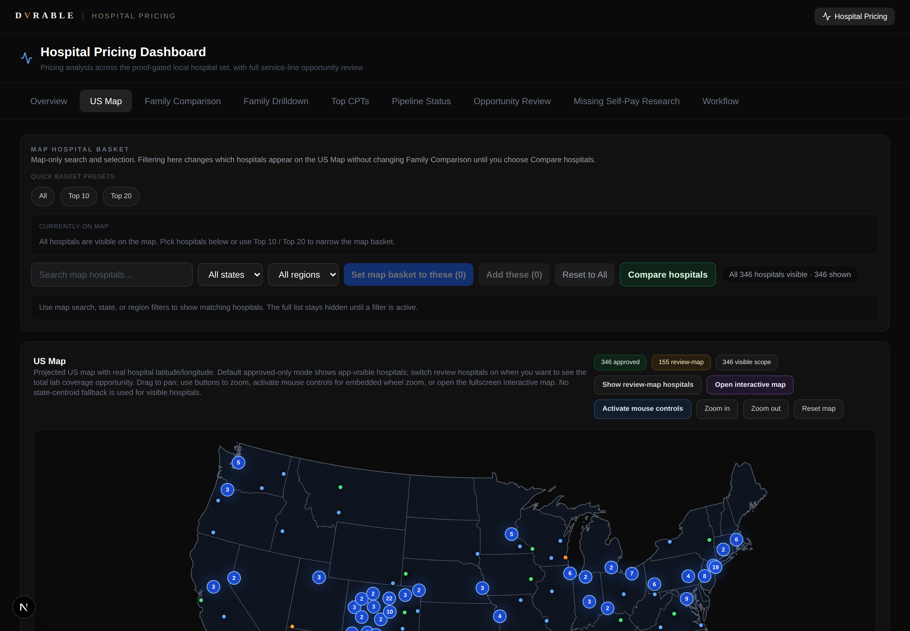
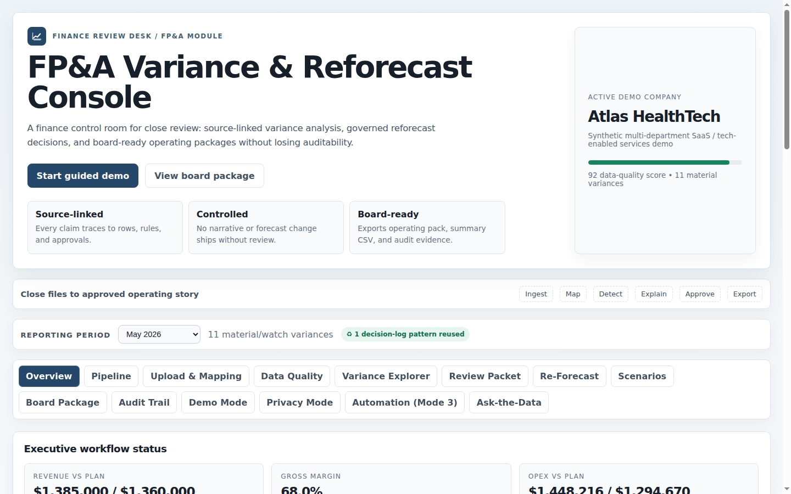
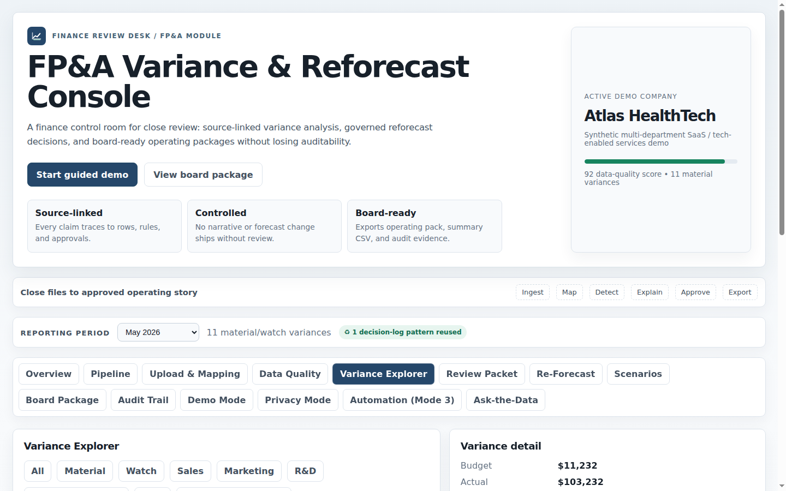

# Eddie Pastore — Finance & Operations Executive Building AI-Native Decision Systems

> I build AI-assisted finance, operations, and healthcare tools that turn complex business problems into usable decision systems — from healthcare pricing intelligence to governed FP&A workflows and internal automation.

I'm a senior finance and operations executive who uses AI-assisted development workflows to build real software: data products, decision-support systems, and consumer apps. I'm not a research scientist — I'm an executive operator who knows how to use AI to build working tools, automate workflows, and turn messy business problems into shipped products.

The projects below were built end-to-end in my AI Product Lab. Together they demonstrate CFO/COO operating judgment, product direction, data architecture, technical adaptability, and AI-enabled execution across very different domains.

---

## Executive Relevance

This portfolio demonstrates CFO-level judgment applied through AI-native systems: FP&A discipline, healthcare finance analysis, privacy-aware AI governance, product execution, and the ability to turn ambiguous operating problems into usable software.

## Executive Finance & AI Decision Systems

These projects are the core executive story: finance, healthcare, governance, data quality, auditability, and board-ready decision support translated into working systems.

### 🏥 [Hospital Pricing Intelligence Platform](case-studies/hospital-pricing-intelligence.md)

A full-stack healthcare price-transparency intelligence platform that transforms raw CMS hospital machine-readable-file data into an interactive decision platform for self-funded employer health-plan strategy.

- **346** approved hospitals live (501 tracked), **58** procedure families, **17,457** CPT-level savings opportunities
- Interactive Next.js app: US map with real lat/long positioning, procedure-family comparison matrix, CPT savings leaderboard, and a data-governance workflow that keeps unverified evidence out of public proof views
- **Proves:** regulatory data extraction, healthcare finance fluency, data-quality governance, and productized decision support

📄 [Read the full case study →](case-studies/hospital-pricing-intelligence.md)

---

### 📊 [FP&A Variance & Re-Forecast Copilot](case-studies/fpa-variance-copilot.md)

A governed AI workflow for finance teams — built from two decades of owning FP&A, board reporting, reforecasting, and operating-plan accountability as a CFO/COO.

The app takes budget, actuals, forecast, KPI, and driver data through the monthly finance close narrative: variance detection against a configurable materiality rulebook, AI-drafted commentary, human review and approval, reforecast proposal by method, and board package generation — with source traceability and an audit trail at every stage. Nothing publishes without explicit human sign-off. Every statement in the final board package links back to source rows and review decisions.

- **14 pipeline stages** from raw upload to published board pack; approval gates enforced at every handoff
- Variance Explorer with materiality tiers, drill-down to source rows, and commentary history
- Re-forecast workbench with method labels (trend extension, driver-adjusted, management override, prior-period anchor) and rationale tracking
- Privacy Mode: financial data obfuscated before any external AI call via the companion Finance Privacy Gateway
- **Proves:** executive FP&A judgment translated into working software — operating rhythm design, governed AI workflow architecture, human-in-the-loop enforcement, and board-ready financial storytelling

  
  

📄 [Read the full case study →](case-studies/fpa-variance-copilot.md)

---

### 🔐 [Finance Privacy Gateway](case-studies/finance-privacy-gateway.md)

AI-native financial analysis without exposing confidential financial data to the model.

CFOs want frontier LLMs for variance analysis, forecast pressure-testing, and board commentary. They don't want external AI providers seeing real revenue figures, customer names, vendor relationships, or cash positions. This gateway sits between the finance data and the model: it performs all financial math locally, transforms data into a semantically equivalent but obfuscated packet, sends only that packet to the LLM, then rehydrates the response with real business terms for authorized users. The LLM never sees a real dollar figure or entity name.

- **Privacy guarantee enforced, not promised** — the packet risk gate and the privacy regression tests share the same leak-scanner code; runtime and testing cannot drift apart
- Permission-aware rehydration at view time: CFO sees the real customer name; board member sees "Top Customer" — same narrative, appropriately disclosed
- Four privacy modes: standard finance, generalized semantic labels, high-privacy (abstract CAT### identifiers), and local-only (no external call at all)
- Pure Python 3.10+ standard library — zero pip dependencies; Docker support included; 71 passing tests including a release-blocking privacy regression test
- **Proves:** practical AI governance for finance — confidentiality judgment, permission-aware disclosure, deterministic controls, and security architecture that finance and executive teams can understand

  
  

📄 [Read the full case study →](case-studies/finance-privacy-gateway.md)

---

## Additional AI Product Builds

These projects show breadth, product taste, and technical adaptability outside the core finance lane. They are included to demonstrate end-to-end execution: product direction, UX, QA, deployment, and AI-assisted development across unfamiliar domains.

### 🦬 [Yakety Yak — Family Allowance Tracker](case-studies/yakety-yak.md)

A consumer SaaS product built end-to-end: a full-stack family allowance tracker — chores, approvals, kid views, a spin-to-assign chore wheel, and payday math — plus the complete brand system, marketing website, and demand-gated go-to-market plan behind it.

- Positioned against $48–$180/yr kid-banking apps: **"You stay the bank"** — no debit card, no account, no money movement
- Next.js + Drizzle/Turso app live in daily family use; price-qualified founding waitlist with a 100-signup gate before any payment infrastructure gets built
- **Proves:** end-to-end consumer SaaS execution — product, brand, GTM, and pricing strategy as one coherent system

📄 [Read the full case study →](case-studies/yakety-yak.md)

---

### 🎮 [Nora's World](case-studies/noras-world.md)

A playable Godot browser platformer built through iterative AI-assisted development — 11 levels, three playable heroes, a multi-phase final boss, mobile controls, custom web export, a credits scene, and automated regression guardrails.

- **▶️ Play it now:** [noras-world.vercel.app](https://noras-world.vercel.app/)
- 42 GDScript files, 36 scenes/resources, 13 Python guardrail scripts, 81 commits in Godot 4.6
- **Proves:** technical adaptability — learning an unfamiliar engine and shipping a complete, browser-deployable product

  
  

📄 [Read the full case study →](case-studies/noras-world.md)

---

### 💪 [Pastore Pump — Family Workout App](case-studies/workout-app.md)

A shared family workout app where everyone trains in the same session on one screen — independent set and rest timers per athlete, live personal-record detection with "🔥 PR!" celebrations, AI-generated cinematic intro/outro videos, and per-athlete stats, badges, and milestones.

- React + TypeScript + Vite, Vercel serverless API, Turso/Drizzle data layer, installable PWA
- **Proves:** consumer UX polish, concurrent-timer state management, and AI-generated media shipped as product content

📄 [Read the full case study →](case-studies/workout-app.md)

---

## How These Were Built

Each project was built using **AI-assisted development workflows**: I direct the product vision, architecture, domain logic, quality bar, and release decisions; AI coding tools accelerate implementation, debugging, test generation, and iteration.

| | I directed | AI assisted with |
|---|---|---|
| **Product** | Vision, scope, feature priorities, UX decisions | Iteration speed, prototyping options |
| **Architecture** | System design, data governance rules, pipelines | Implementation patterns, scaffolding |
| **Domain logic** | Healthcare finance rules, benchmark policy, game design | Translating rules into working code |
| **Quality** | QA, validation, regression guardrail strategy | Automated test and guardrail scripts |

## Why It Matters

Most AI-native builders lack operating judgment. Most senior executives lack practical AI fluency. My work sits in the overlap: executive judgment, financial and operational strategy, systems thinking, product direction, and hands-on AI-assisted development.

---

## Contact

- 📧 eddie.lab.ai [at] gmail [dot] com
- 🗂 Full case studies: [`case-studies/`](case-studies/)

*Source code for the projects above is kept in private repositories by design (the healthcare platform touches regulated pricing data; see each case study for what is and isn't public). Demos, walkthroughs, and code samples are available on request.*
