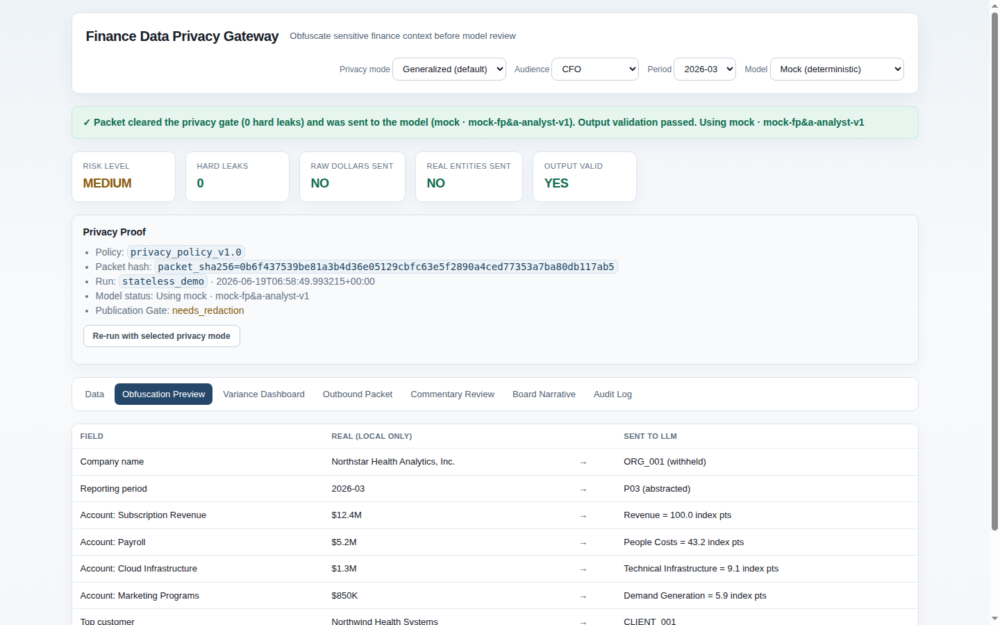

# Finance Privacy Gateway

## What this is

A privacy architecture that lets finance teams use frontier AI models for variance analysis, forecast pressure-testing, and board commentary — without sending confidential financial data to the model.

The gateway sits between your finance data and the LLM. It performs all financial math locally, transforms the data into a semantically equivalent but obfuscated packet, sends only that packet to the model, then rehydrates the response with real business terms for authorized users.

> **Preserve reasoning value. Destroy identification value.**

The LLM sees `CLIENT_001 represents 31% of revenue` and `Revenue = 100.0 index points, -5.3% vs budget`. It never sees a company name, a real customer or vendor, or a single real dollar figure. Every dollar in the final board narrative is inserted locally — never produced by the model.

---

## Why I built it

When AI models started becoming genuinely useful for financial analysis — explaining variance patterns, pressure-testing forecasts, drafting board commentary — CFOs faced a real governance problem.

The tools were powerful. The data was sensitive.

Revenue breakdowns, customer concentration, vendor relationships, payroll, cash positions, margin by product line — this is often material non-public information. Sending it to an external model creates data governance risk, confidentiality exposure, and in some cases legal exposure. The standard workarounds (redacting data, using aggregates, building internal models) either destroy analytical value or require significant engineering investment.

I've been in enough CFO and Board conversations about this exact tension to know it's a real friction point, not a theoretical one. The privacy problem is one reason finance teams hesitate to use frontier AI for sensitive work — even when the tools would help.

This gateway is a third path: preserve the analytical relationships the model needs, remove the business-identifying facts it should not see, and keep the final accountability with authorized finance leaders.

---

## How it works

```
Upload CSVs → Local finance engine (all math, Decimal precision)
  → Materiality engine → Semantic Obfuscation (aliases + value indexing)
  → Packet Risk Gate ─(blocked on hard leak)─→ withhold
       │ (clean)
       ↓
  Frontier LLM → Response Validator → Rehydration (permission-aware)
  → Human Review → Board Narrative (real dollars inserted locally)
```

**Three guarantees that are enforced, not promised:**

1. No raw dollar figures leave the system — all values are indexed relative to a base before any outbound packet is built.
2. No real entity names leave the system — company names, customers, vendors, and employees are replaced with stable aliases.
3. The packet risk gate and the privacy regression tests share the same code — runtime enforcement and test coverage cannot drift apart.

---

## Key capabilities

**Semantic Obfuscation Engine** — Aliases are stable within a session (CLIENT_001 always refers to the same entity). Values are indexed, not removed — so variance relationships and proportions are preserved for LLM reasoning while identification is destroyed.

**Packet Risk Gate** — Every outbound packet passes a leak scanner. Hard leaks block transmission. No partial pass.

**Multiple Privacy Modes**

| Mode | Account labels | Best for |
|---|---|---|
| `standard_finance` | Real account names | Internal models, maximum analysis quality |
| `generalized_semantic_labels` | Generalized (Payroll → People Costs) | Normal sensitive CFO workflows |
| `high_privacy` | Abstract (CAT_017 + descriptor) | Board strategy, M&A, fundraising, layoffs |
| `local_only` | No external call | Maximum sensitivity |

**Permission-Aware Rehydration** — Commentary is stored obfuscated. At view time, real terms are inserted based on the viewer's permission level. A CFO sees the real customer name. A board member sees "Top Customer." Same narrative, appropriately disclosed.

**Human Review & Board Narrative** — AI-drafted commentary queued for human approval before any narrative is published. Final board output is assembled locally — real dollar figures inserted at publish time, never produced by the model.

**REST API** — Full Section-15 API for integration. Powers the [FP&A Variance Copilot](fpa-variance-copilot.md) Privacy Mode.

**Zero dependencies** — Pure Python 3.10+ standard library. No pip installs. Docker support included.

**72 passing tests** — Including a release-blocking privacy regression test that proves the leak scanner and runtime gate cannot drift apart.

---

## Technical build

- Pure Python 3.10+ standard library (no pip, no venv, no setup friction)
- Decimal math for all financial calculations (no floating-point rounding in materiality decisions)
- SQLite persistence with a Postgres-ready schema and ORM layer
- Unified server: dashboard UI + REST API + SQLite on one process
- Docker support via Makefile
- 72 tests including `test_privacy_regression.py` (release-blocking)

---

## What this proves

**Finance domain credibility** — The privacy modes, materiality rules, rehydration permission model, and board narrative structure reflect real CFO-level concerns: confidentiality, disclosure, executive trust, auditability, and usefulness.

**Security architecture without unnecessary complexity** — The privacy guarantee is enforced by having the leak scanner and the test oracle share the same code. Enforcement and testing cannot drift. The design is understandable to finance and executive teams, not just engineers.

**Practical AI governance** — This is what "responsible AI in finance" actually looks like: local math, obfuscated packets, validated responses, human review gates, and an audit trail. Not a policy document — a working system.

**Complement to the FP&A Copilot** — These two tools are designed to work together. The FP&A app routes through the privacy gateway when Privacy Mode is enabled. The LLM never sees real financial data at any point in the pipeline.

---

## Screenshots




---

*Source code is public under the MIT license: [github.com/eddiepastore/finance-privacy-gateway](https://github.com/eddiepastore/finance-privacy-gateway). All data is synthetic. Demo and walkthrough available on request.*
