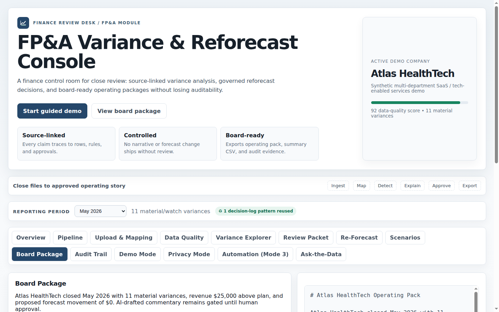

# FP&A Variance & Re-Forecast Copilot

## What this is

An AI-enabled finance workflow application that takes budget, actuals, forecast, KPI, and driver data through a governed monthly FP&A process — variance detection, materiality classification, AI-drafted commentary, human review and approval, reforecast proposal, and board package generation — with source traceability and a full audit trail at every step.

This is not a dashboard. It models the operating rhythm a finance leader actually has to own: what changed, why it changed, what it means for the forecast, and what the CEO and Board need to understand.

---

## Why I built it

I've run FP&A processes for growth-stage, service-based, technology-enabled, and regulated organizations for two decades. As a CFO/COO and finance executive, I've owned $100M+ operating plans, supported $11.6M of capital formation, managed executive and Board reporting, and led forecasting across multi-entity operating models. Variance commentary and reforecasting are among the most time-consuming and judgment-adjacent tasks in the monthly cycle.

Every month: pull actuals, decide what's material, explain the timing vs. structural variances, update the forward-looking view, draft the executive narrative, publish a board pack. Most of the mechanical work was repetitive. The judgment work — what matters, what the business needs to hear, what the board pack should say — was not.

AI can compress the repetitive parts without removing the human from the judgment parts. But only if the workflow preserves materiality discipline, source traceability, and human sign-off. Without those, you end up with AI-generated commentary no CFO can stand behind.

This app is the governed version: automation for the repeatable work, controls around the sensitive work, and human judgment preserved where accountability belongs.

---

## How it works

```
Upload & normalize → Variance detection → Materiality classification
  → AI commentary draft → Human review & approval → Reforecast proposal
  → Board package generation → Audit trail
```

Every stage is controlled. Nothing publishes without explicit human approval. Every statement in the final board package links back to source rows and review decisions.

---

## Key capabilities

**Upload & Data Mapping** — CSV uploads from any source system with column mapping, checksums, row counts, exception flags, and rollback paths. Bad data is quarantined, not silently dropped.

**Variance Explorer** — Material variances classified by tier, direction, and category against a configurable materiality rulebook. Drill-down links to source rows.

**AI Commentary Drafting** — First-pass variance commentary drafted by AI, clearly labeled as draft until a human acts on it. No commentary reaches a board package in draft state.

**Human Review Workflow** — Accept, Edit, or Reject for every material variance. Edits tracked. Rejections logged with reason. The publish gate checks the review queue — it can't be bypassed.

**Re-Forecast Workbench** — Forecast adjustments proposed by method: trend extension, driver-adjusted, management override, prior-period anchor. Each carries a labeled rationale. Approved reforecasts update the forward view.

**Scenario Planning** — Best-case, base-case, and downside scenarios with separate driver assumptions, compared in a single view.

**Board Package Generation** — One-click board-ready operating package in Markdown: period performance, approved variance commentary, reforecast summary, key risks, and KPI trends. Can only be generated after all review gates close.

**Audit Trail** — Every event in the pipeline logged with timestamp, actor, and data reference. Append-only.

**Privacy Mode** — Sensitive financial data obfuscated before any external AI call, via the [Finance Privacy Gateway](finance-privacy-gateway.md). The LLM never sees real financials. The reviewer sees real business language. See the companion case study.

**Ask-the-Data** — Read-only SQL preview against the canonical data model with source attribution.

---

## Technical build

- React/TypeScript frontend with a local finance engine (no backend required for demo)
- Deterministic materiality rules and variance logic (AI drafts; rules decide what matters)
- Human approval gates at every pipeline stage
- Board package markdown generation with source-linked statements
- Audit trail (append-only event log)
- Privacy Gateway integration via REST API
- 29 passing tests

The design principle: **deterministic first, AI second.** Rules, calculations, thresholds, and source facts are deterministic. AI drafts and suggests — it does not invent financial truth.

---

## What this proves

This project demonstrates the combination an executive recruiter should care about: senior finance judgment, operator-level process fluency, and the practical ability to turn AI from a buzzword into governed business software.

- **FP&A domain fluency** — the materiality rulebook, commentary categories, reforecast methods, and board pack structure reflect real finance practice, not generic workflow software
- **Executive communication judgment** — the workflow is designed around decision-ready board narrative, not just analysis output
- **Governed AI workflow** — AI as infrastructure for a controlled process, not as a text generator attached to a spreadsheet
- **Human-in-the-loop architecture** — approval gates that are actually enforced, not cosmetic
- **Audit-ready design** — every decision traceable to its source data and the human who made it
- **Privacy-aware by default** — financial data protection built into the architecture, not bolted on

---

## Screenshots




---

*Source repository is private. Demo, walkthrough, and code samples available on request.*
