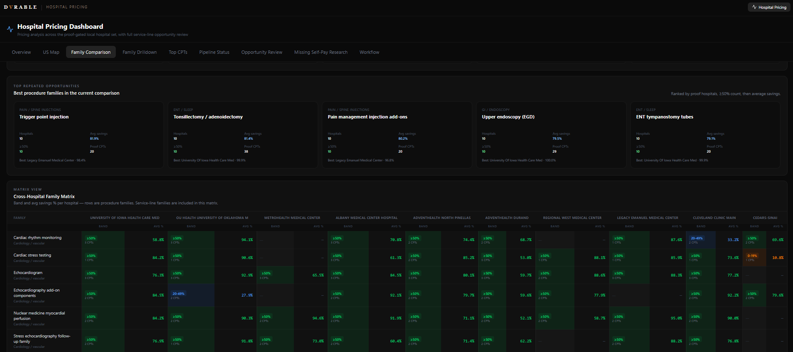
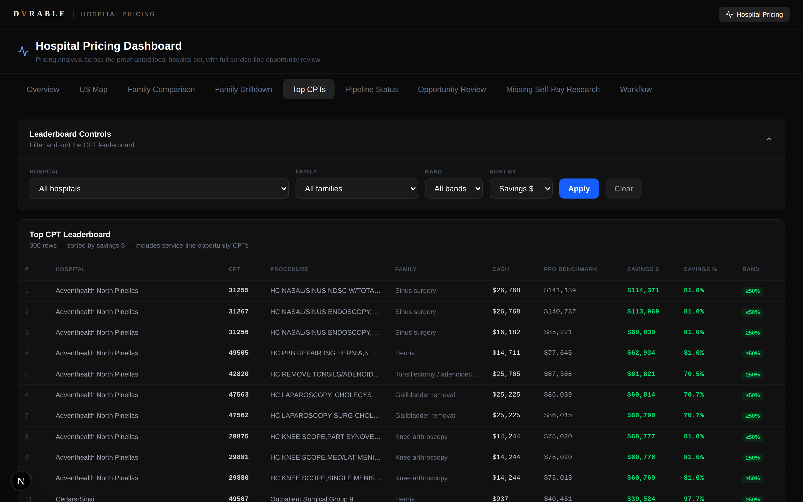
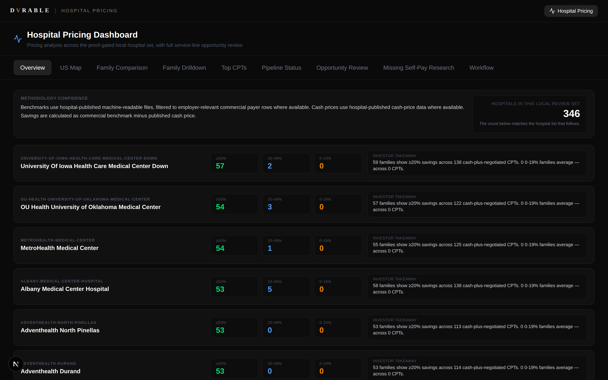
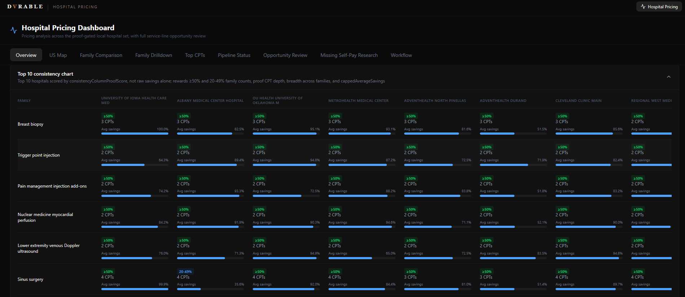

# Hospital Pricing Intelligence Platform

## One-Line Summary

A full-stack healthcare price-transparency intelligence platform that transforms raw CMS hospital machine-readable-file (MRF) data into an interactive decision platform for self-funded employer health-plan strategy.

## Problem

Federal price-transparency rules require hospitals to publish machine-readable files of their prices — but the raw data is enormous, inconsistent, and nearly unusable for decision-making. Self-funded employers, advisors, and investors lack a practical way to answer a high-value question: **where do hospital cash/self-pay prices beat commercial benchmark rates, and by how much?**

## Product

An interactive intelligence platform that identifies where hospital cash/self-pay prices may beat commercial benchmark rates, and organizes the results into a workflow suitable for diligence, employer health-plan strategy, and investor-facing demonstration.

The app turns messy public regulatory data into a structured, defensible decision platform — not just a dashboard.

## What I Built

- **Data pipeline** — extraction and normalization of CMS hospital machine-readable files into a structured pricing database
- **Proof-governance system** — data-quality controls that separate approved proof, review queues, self-pay research gaps, benchmark-policy review, and diligence-only holds, so weak or unverified evidence never reaches public-facing views
- **Interactive Next.js application** with nine workflow tabs: Overview, US Map, Family Comparison, Family Drilldown, Top CPTs, Pipeline Status, Opportunity Review, Missing Self-Pay Research, and Workflow
- **Geospatial UI** — a Google-Maps-like hospital map with real latitude/longitude positioning (D3 / Albers USA projection), clustering, search, state and region filtering, hospital detail panels, and drill-through into CPT-level savings
- **Analysis layer** — procedure-family comparison matrix across hospitals, savings bands (≥50%, 20–49%, emerging signals), and a CPT leaderboard with cash price, commercial benchmark, dollar savings, percent savings, procedure descriptions, and proof bands
- **Command Center** — launch/status controls and an internal review workflow for promoting hospitals from "tracked" to "approved live"
- **Investor/demo-safe variant** — a curated 97-hospital build suitable for external demonstration

The cross-hospital family matrix compares every procedure family against every hospital, color-coded by savings band, and surfaces the most repeated high-savings opportunities across the proof-gated set:

The CPT leaderboard ranks individual procedures by savings against PPO benchmarks, with proof bands keeping confidence levels explicit:

The Overview tab summarizes each approved hospital's savings profile, with the methodology stated up front:

A consistency-scoring view ranks the top hospitals not on raw savings alone, but on a weighted score that rewards proof depth, breadth across procedure families, and capped average savings — so the leaders are the ones that perform reliably across the board, not just on a single outlier procedure:

## Metrics / Proof

| Metric | Value |
|---|---|
| Hospitals tracked in command-center database | **501** |
| Approved hospitals promoted into the live app | **346** |
| Procedure families | **58** |
| Positive CPT-level savings rows | **17,457** |
| Hospitals with positive savings opportunities | **342** |
| Investor/demo-safe variant | **97 hospitals** |

## AI Workflow Design

I designed the hospital pricing platform as more than an AI-assisted build. The harder problem was the data operation behind it: turning raw hospital price-transparency files into decision-grade evidence a human decision-maker could actually trust.

The workflow runs as a governed multi-agent system. A multi-agent orchestration layer coordinates source discovery, parsing, QA, review packets, and result delivery. Local models handle bounded synthesis and classification tasks. A structured reasoning agent prepares review context, but final promotion decisions stay with a human. No model is trusted with production work until it proves itself on a small real task first.

The same workflow pattern applies directly to finance systems: controlled data ingestion, repeatable transformations, exception review, approval gates, audit trails, and executive-ready reporting.

The important part is the governance layer:

- **Reusable runbooks and skills** — Evidence standards, review formats, and operating rules live in version-controlled runbooks and reusable skills. Agents read those first, so the workflow depends on documented process rather than chat memory or informal handoffs.
- **Staged gates** — Each hospital moves through a fixed sequence: target, source discovery, verification, parse, QA, benchmark policy review, proof classification, app snapshot, and optional deploy. A parsed hospital is not treated as QA-passed. A benchmark-reviewed hospital is not treated as publication-ready.
- **Policy-based classification** — Benchmark decisions follow a written rulebook for include, exclude, and hold logic. The model does not get to invent policy.
- **Designed review experience** — Review packets surface the proof block, service-line comparison, benchmark sensitivity, payer/plan labels, and decision cards in a format built for human review, not just machine output.
- **Human approval and audit trail** — No publish, deploy, or destructive write happens without explicit approval. Database writes are protected by rollback artifacts, and each promotion decision leaves a reviewable trail.
- **Deterministic learning loop** — When a human-approved decision generalizes, it is written back into a decision log so the system relitigates fewer calls over time.
- **Safe batch autonomy** — Once a workflow path is validated, low-risk work like machine-readable-file sweeps can run in resumable background batches with documented recovery steps and escalation rules.

Result: AI accelerates extraction, normalization, classification, and review throughput, while the workflow keeps weak or unverified evidence out of the public-facing product. The system improves both speed and trust by combining automation with rules, gates, and human approval.

## My Role

I owned the product vision, healthcare-finance logic, benchmark policy, AI workflow design, multi-agent architecture, proof-quality rules, review packet design, QA, validation, and every promotion decision from raw data to approved public proof.

## Tech

Next.js · React · TypeScript · D3 / d3-geo / TopoJSON · Albers USA projection · Vercel · SQLite · OpenClaw · Ollama · Claude · Hermes skills/runbook layer

## Demo / Links

- **Demo:** private — live walkthrough available on request
- **Source:** private repository by design — the project touches healthcare pricing, CMS data redistribution, and benchmark logic, so it is published as a case study and sanitized demo rather than a public repo

---

*This platform analyzes publicly disclosed hospital pricing data. It is a decision-support and research tool and does not constitute medical, legal, or financial advice.*
