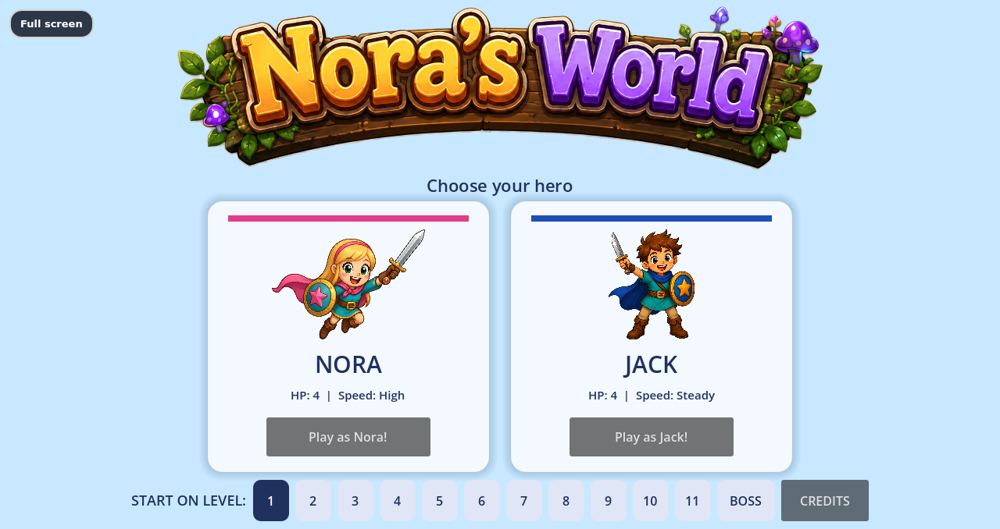
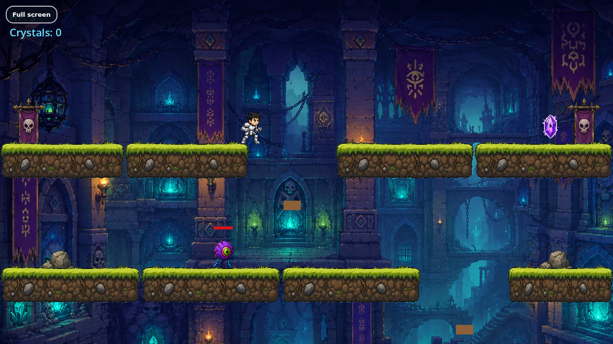
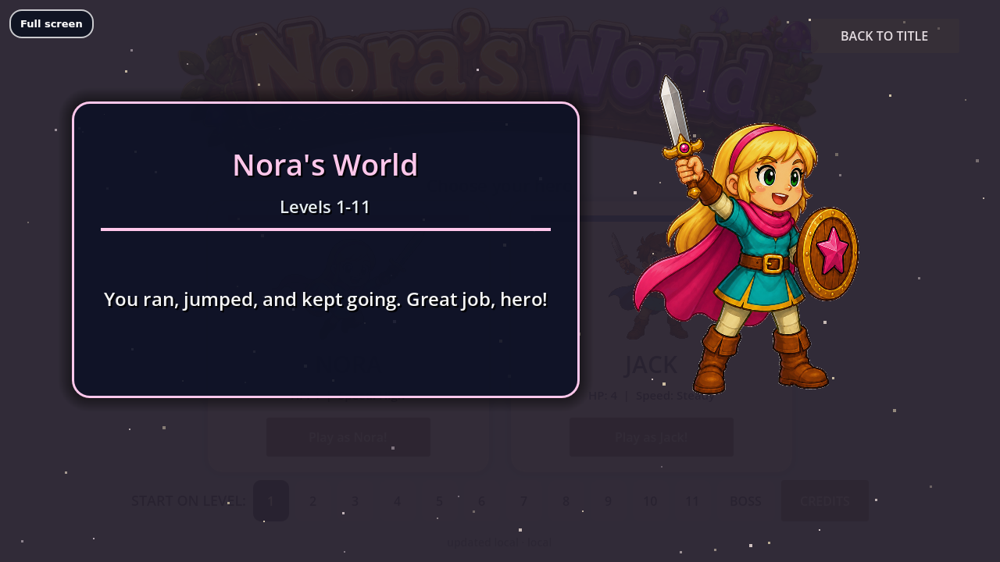

# Nora's World

## One-Line Summary

A playable Godot browser platformer built through iterative AI-assisted development — 11 levels, three playable heroes, enemy and final-boss mechanics, mobile controls, custom web export work, music/cutscene handling, a credits scene, and automated regression guardrails.

**▶️ Play it now: [noras-world.vercel.app](https://noras-world.vercel.app/)**

## Problem

This project started as a creative goal — build a real, playable game for my daughter — and became a deliberate test of a harder question: **can AI-assisted development make an unfamiliar technical domain (game development in Godot) productive enough to ship a complete, browser-deployable product?**

## Product

A complete 2D platformer that runs in the browser on desktop and mobile:

- 11 main playable levels plus a final-boss practice arena, selectable from the title screen
- Two selectable heroes (Nora and Jack) with different stats — and Joe, a surprise armored third hero who takes over for the late-game dungeon arc and the Skyforge moving-platform gauntlet
- Enemy types, projectiles, and a multi-phase final boss — "Big Mouth"
- Pickups, checkpoints, gates, and moving platforms
- Touch controls for mobile play
- Music, cutscenes, and a credits scene
- HTML5 web export deployed to Vercel

## What I Built

- **Game systems** — player movement and combat, enemy AI, the Big Mouth final-boss fight, checkpoints, level gating, and pickup/crystal economy across 42 GDScript files and 36 scene/resource files

  
  

- **Mobile support** — on-screen touch controls so the same build plays on iPad and phone
- **Web export pipeline** — custom Godot HTML5 export work and Vercel deployment so anyone can play from a link, no install
- **Regression guardrails** — 13 Python tooling scripts that catch regressions across levels and scenes as the game grew, keeping iteration safe over 80 commits
- **Audio/visual routing** — music and cutscene handling, including web-safe fallbacks for browser playback restrictions

## Metrics / Proof

| Metric | Value |
|---|---|
| Playable levels | **11** + final-boss practice |
| GDScript files | **42** |
| Godot scene/resource files | **36** |
| Python guardrail/tooling scripts | **13** |
| Commits | **81** |
| Engine | **Godot 4.6** |
| Deployment | **Browser (HTML5 export on Vercel)** |

## AI-Assisted Development

AI tools assisted with GDScript implementation, Godot engine patterns, debugging physics and collision issues, web-export troubleshooting, and generating the guardrail scripts. This was the core experiment: directing AI through a domain I had no prior professional experience in.

## My Role

I directed the game design, level design, difficulty tuning, art and audio selection, feature priorities, playtesting/QA (with a very demanding lead tester), and every release decision — and built the iteration and guardrail workflow that kept an expanding codebase stable.

## What This Proves

Not that I'm a professional game developer — something more useful:

- I can learn a new technical domain quickly and ship in it
- I can direct AI-assisted development across a complex, multi-system product
- I can sustain iteration over many commits without losing stability
- I can take a product all the way to a deployed, playable, shareable artifact

## Demo / Links

- **Demo:** [noras-world.vercel.app](https://noras-world.vercel.app/) — playable in any modern browser, desktop or mobile
- **Source:** private repository; code walkthrough available on request
