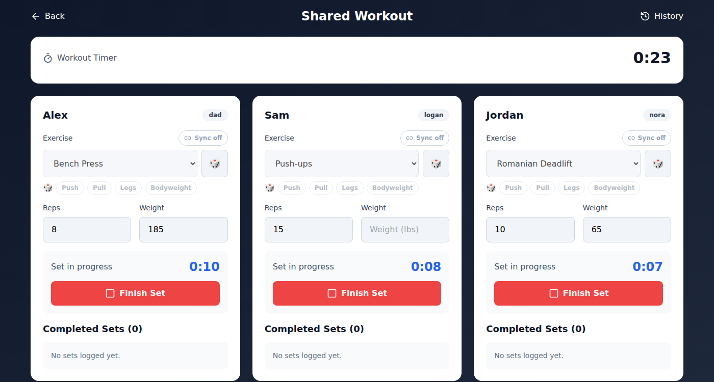
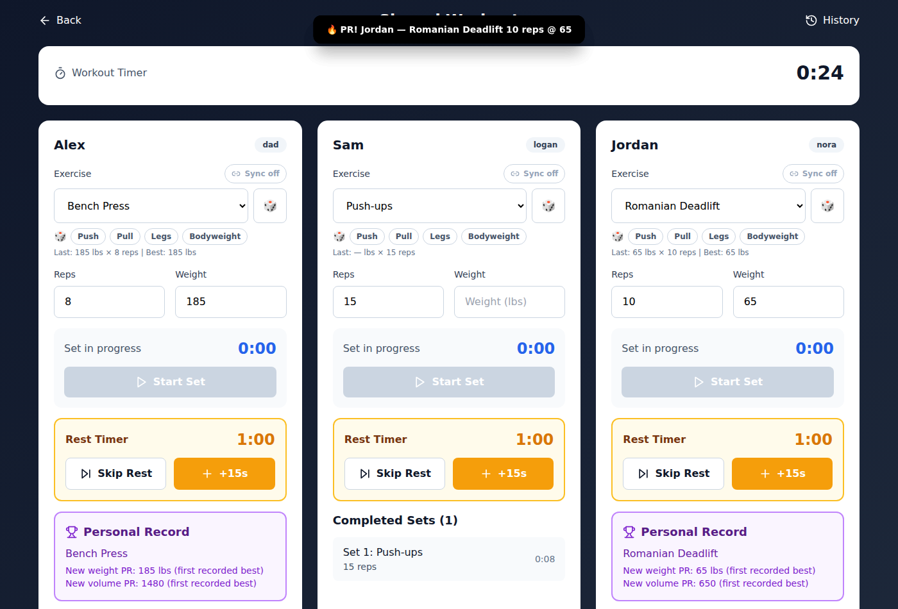
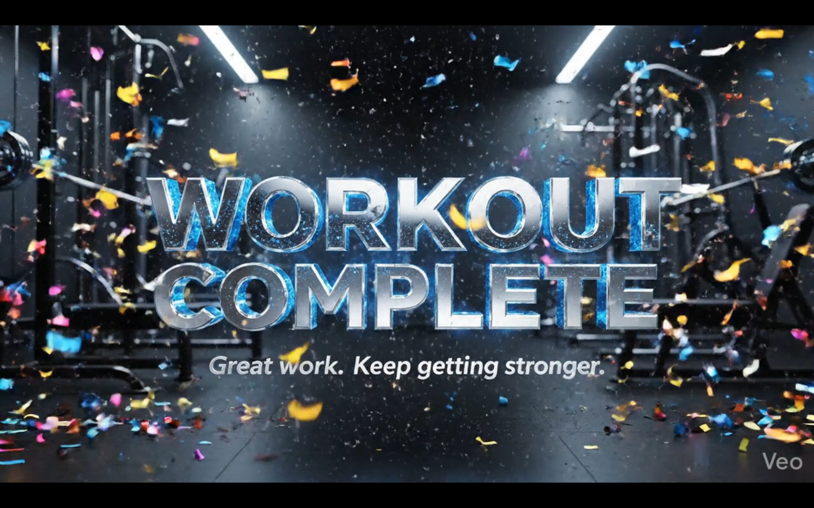
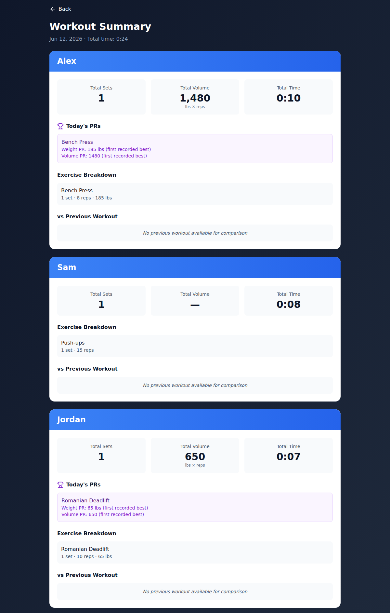
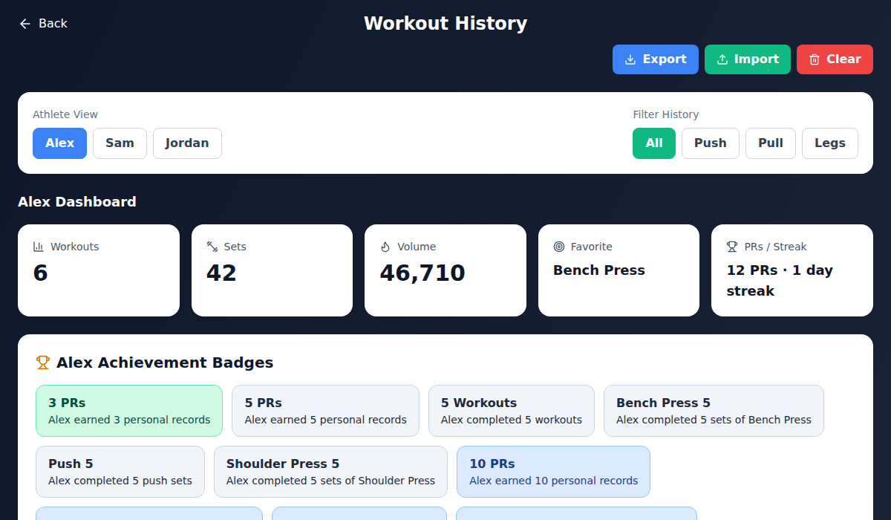

# Pastore Pump — Family Workout App

## One-Line Summary

A shared family workout app where everyone trains in the same session on one screen — independent set and rest timers per athlete, live personal-record detection, AI-generated cinematic intro/outro videos, and per-athlete stats, badges, and milestone tracking.

*Family app — live version is invite-only; demo walkthrough available on request.*

## Problem

Family workouts run on different clocks. Three people doing three different exercises with different rest needs can't share one timer or one phone-bound fitness app — so nobody tracks anything, and "did I beat my best?" is guesswork. Generic fitness apps assume one user, one program, one device.

## Product

One screen runs the whole family's session:

- **Session setup** — check off who's working out today, then start a shared session with one tap
- **Cinematic bookends** — the session opens with an AI-generated flaming-logo intro video and closes with a confetti "Workout Complete" celebration video
- **A lane per athlete** — each person gets their own column: exercise picker (21+ exercises), Push/Pull/Legs/Bodyweight category chips, a 🎲 randomizer for "surprise me" days, and reps/weight inputs
- **Independent timers** — each lane runs its own set timer, then its own rest countdown with Skip Rest and +15s controls; a global workout timer tracks the whole session. A Sync toggle can lock lanes together for circuit-style training
- **Live PR detection** — finishing a set instantly checks weight and volume records: a "🔥 PR!" banner fires across the top and a Personal Record card appears in the lane; each exercise also shows inline "Last" and "Best" stats so targets are visible before the set
- **Workout Summary** — per-athlete totals (sets, volume, time), Today's PRs, exercise breakdown, and a vs-previous-workout comparison
- **History dashboard** — per-athlete stats (workouts, sets, volume, favorite exercise, PR count, day streak), achievement badges, next-milestone progress bars, athlete and category filters, and JSON export/import/clear for data ownership

## What I Built

- **Concurrent-timer state machine** — N independent lanes, each cycling exercise → active set → rest → next set, on top of a single shared session, without state bleed between athletes
- **PR engine** — per-athlete, per-exercise weight and volume records computed live against full history, with first-time bests handled gracefully
- **Session resilience** — active-session state persists to localStorage, so an accidental refresh mid-workout drops nobody's timers
- **Stats and gamification layer** — summary aggregation, previous-workout comparisons, streaks, badges, and milestone progress designed to keep kids motivated between sessions
- **Media moments** — AI-generated intro/outro videos with synchronized audio that turn family workouts into an event
- **Full-stack plumbing** — React + TypeScript + Vite front end, Vercel serverless API routes, Turso (libSQL) database via Drizzle ORM, installable as a PWA

  
  

## Metrics / Proof

| | |
|---|---|
| Deployment | Vercel — in real weekly family use (invite-only) |
| Stack | React · TypeScript · Vite · Vercel serverless · Turso (libSQL) · Drizzle ORM · PWA |
| Core flows | Setup → intro video → multi-lane live session → PR detection → celebration → summary → history |
| Exercise library | 21+ exercises across Push / Pull / Legs / Bodyweight |
| Data ownership | One-click JSON export/import of full workout history |

## AI-Assisted Development

AI assisted on two fronts: AI-assisted coding for the concurrent timer logic, PR engine, and UI iteration — and AI-generated media (the cinematic intro and celebration videos) as shipped product content, not just development tooling.

## My Role

I directed the product concept and the multi-athlete UX model, the PR and gamification design, feature priorities, QA with the toughest user base available (my own kids, mid-workout), and every release decision.

## What This Proves

- Consumer UX thinking and product polish — the app makes a family workout feel like an event
- Non-trivial state management: concurrent independent timers over one shared session
- A complete data product in miniature: live detection, aggregation, comparison, history, and export
- Range with AI: assisted code *and* generated media in one shipped product

## Demo / Links

- **Source:** private repository; code walkthrough available on request
- *Live app is in daily family use — demo walkthrough available on request.*
