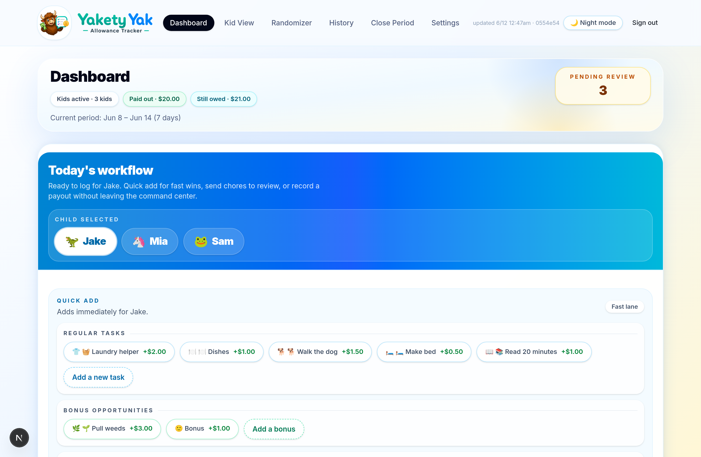
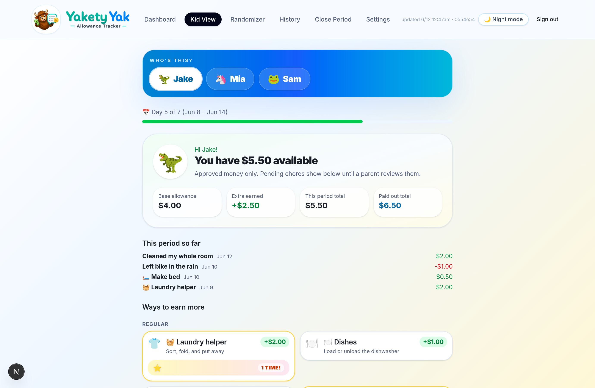

# Yakety Yak — Family Allowance Tracker

## One-Line Summary

A consumer SaaS product built end-to-end: a full-stack family allowance tracker web app, plus the complete brand system, marketing website, and demand-gated go-to-market plan behind it.

## Problem

Most parents of kids roughly 4–12 don't have a kid-banking problem — they have a **memory problem**: "Dad, you owe me for three weeks." Chores, bonuses, penalties, and payday math live in a parent's head, a fridge chart that died in March, or a spreadsheet nobody updates. The incumbent apps (Greenlight, GoHenry, BusyKid, FamZoo) answer this with a debit card and a bank account at $48–$180/year — overkill for this stage of childhood.

Yakety Yak's positioning: **"You stay the bank."** It keeps chores, approvals, and payday totals straight without a card, an account, or moving a dollar of your money.

## Product

A web app the whole family actually uses:

- **Today's workflow** — a parent command center with per-child quick-add buttons for regular tasks, bonus opportunities, and penalties
- **Review queue** — kids' work goes in as "Still deciding"; nothing counts until a parent marks it "Count it now." The ledger reflects decisions, not claims
- **Kid View** — each child sees their approved balance, pending items, recent history, and "Ways to earn more," which ends the payday negotiations
- **Randomizer / Wheel of Work** — spin-to-assign wheels that turn contested chores into a game
- **Period Closeout & payouts** — weekly periods close into an official balance with full payout tracking, so "what do I actually owe you?" always has an answer
- **Signed-ledger accounting** — every entry is a signed amount with type, status, and audit trail; official closed balance, current-period total, and estimated balance are all derived, never hand-edited

## What I Built

**The product:**

- Full-stack Next.js app (React, TypeScript, Drizzle ORM, Turso/libSQL, shadcn/Base UI) — migrated and productized from my original prototype, preserving battle-tested allowance accounting rules
- The domain logic: entry types, approval states, auto-negated deductions, period accounting, and floor-at-zero balance rules
- A first-run onboarding tour built localStorage-only, so it can never touch saved family data
- Waitlist infrastructure: a public signup endpoint with validation, dedupe, and a bot honeypot, plus an in-app admin dashboard tracking signups by source

**The business layer:**

- A complete brand system: logo set with yak mascot, palette, typography, voice, and a strict product vocabulary used verbatim across app and marketing so they sound like one product
- A full website strategy and page-by-page content plan: a lean seven-page site (Home, Pricing, Why No Debit Card, How It Works, About, FAQ, legal) built around one conversion goal
- A self-contained interactive HTML preview of the entire site as the build blueprint
- An isolated demo environment with a seeded fictional family and a Playwright screenshot pipeline — production family data never appears in marketing material

**The operating discipline (the part I'd argue matters most):**

- **Price-qualified lead capture before payment infrastructure.** No billing gets built until 100 organic waitlist signups — each collected with the $29/year price visible, so every email is a real demand signal, not vanity
- **Honest urgency only.** The founding offer (first 25 families lock $29/year for life; $39/year after) works at zero signups and never displays an invented number
- **Hard data-isolation rules.** Marketing and demos run only against the seeded demo instance; the production database is untouchable

## Metrics / Proof

| | |
|---|---|
| Stack | Next.js · React · TypeScript · Drizzle ORM · Turso (libSQL) · shadcn/Base UI · Tailwind |
| App surfaces | Dashboard · Kid View · Randomizer · History · Close Period · Settings · Waitlist admin |
| Status | Live and in daily use running a real family's allowance, every week |
| Go-to-market | Seven-page site plan, price-qualified founding waitlist, 100-signup gate before any payment infrastructure |
| Pricing model | $29/yr founding (first 25 families, locked for life) → $39/yr standard |

## AI-Assisted Development

This project pushed the lab's AI-assisted model furthest: beyond implementation, debugging, and iteration, I directed an AI agent operating as **CMO** under binding founder directives — brand and legal guardrails, no fake numbers, no founder-led selling, demand-gated spending. The AI drafted strategy, content, and code; the directives, judgment calls, and approvals stayed with me.

## My Role

Founder and product owner: the product concept, the allowance accounting rules, the positioning against kid-banking incumbents, the pricing and demand-gate strategy, the brand and legal guardrails, QA with the toughest user base available (my own kids), and every release and go-to-market decision.

## What This Proves

- End-to-end consumer SaaS execution: product, brand, website, and GTM as one coherent system
- Business judgment under uncertainty — validating demand before spending on payment infrastructure
- Data governance instincts (production/demo isolation, privacy-by-design: no kid accounts, no kid emails, no ads)
- The ability to direct AI agents with executive-grade guardrails, not just prompts

## Demo / Links

- **Demo:** live walkthrough of the app and the seeded demo instance available on request
- **Source:** private repository; the production app holds real family data, so it is published as a case study with demo-instance screenshots
